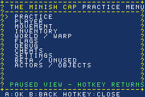
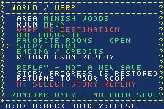

# TMC Practice

A runtime practice and exploration menu for **The Legend of Zelda: The Minish Cap**.
Supports the original **USA, Europe and Japan** releases through three separate BPS patches.

[English](docs/README_EN.md) · [Deutsch](docs/README_DE.md) · [Français](docs/README_FR.md) · [Español](docs/README_ES.md) · [Italiano](docs/README_IT.md) · [日本語](docs/README_JA.md)

Full user guides are available in all six languages above. The Practice menu itself remains in English.

[Controls and features](docs/USER_GUIDE.md) · [Build from source](docs/BUILDING.md) · [Verification](docs/VERIFICATION.md)

## Download and install

Open the [Releases page](https://github.com/Nimcoz/TMC-Practice/releases) and download **TMC Practice v1.0.0**.
Choose exactly one patch:

| Your original game | Patch |
| --- | --- |
| USA | `TMC-Practice-v1.0.0-USA.bps` |
| Europe — English, French, German, Spanish, Italian | `TMC-Practice-v1.0.0-Europe.bps` |
| Japan | `TMC-Practice-v1.0.0-Japan.bps` |

1. Back up your regular in-game save.
2. Apply the matching BPS patch to your **unmodified original ROM** using a BPS-compatible patcher.
3. Open the resulting `.gba` in your emulator and load a normal same-region save.
4. Press **L + R + Select** to open or close the Practice menu.

Do not stack regional patches, patch an already modified ROM, or load emulator
savestates from older builds. No ROMs, save files or emulator savestates are included.
Exact supported ROM fingerprints are listed in [ROM compatibility](docs/ROM_COMPATIBILITY.md).

## What is included?

- Practice timer and on-screen debug information.
- Player, movement, inventory and individual element controls.
- No-Clip and exploration tools, including interiors and gaps.
- Room warps, favorites and native intro / ending replays.
- Flag inspection/editing and collection/completion actions with confirmations.
- Free camera, resource cheats, boss-inclusive Enemy Freeze and Break Free.
- Named raw actor spawner, individual freeze/remove/position editing and teleporting in both directions.
- Infinite Time for supported native countdowns and effects.
- Persistent menu settings, themes and configurable button combinations.
- Menu access over supported native inventory, dialogue, intro and ending screens.

The Practice interface is in English. The original European language selection
and Japanese game text remain intact. See the [user guide](docs/USER_GUIDE.md)
for the exact feature scope and important safety limits.

## Tested, with honest limits

The release uses the existing tested binaries without changing their runtime:
**53 USA suites + 113 EU/JP suites = 166 automated mGBA suites**.
This includes complete intro/ending replays, save restoration, native save/reload,
menu/HUD screenshots, both regional new-game starts and all five EU languages.
The project tester also confirmed menu opening and No-Clip in their own emulator test.

This is an expert practice tool. Invalid actor/room combinations and destructive
save edits can break the current room or progress. Keep backups. No guarantee is
made for every emulator, real hardware, ROM revision or arbitrary actor variant.

## Contributions by prior agreement only

Contributions to the official TMC Practice project are accepted only by prior
agreement with [Nimcoz](https://github.com/Nimcoz). Before starting work intended
for inclusion or submitting a pull request, open an issue and wait for explicit
approval. Bug reports are welcome without prior agreement.

**Mitarbeit nur nach vorheriger Absprache mit Nimcoz.** See
[CONTRIBUTING.md](CONTRIBUTING.md) for the German and English policy.

## Reporting a problem

Use the repository's **Issues** tab. Include the region, patch version, emulator
and version, exact steps, and a screenshot if useful. Do **not** attach a ROM,
private save, login information or other personal data.

## Credits and rights

See [CREDITS.md](CREDITS.md) and [THIRD_PARTY_NOTICES.md](THIRD_PARTY_NOTICES.md).
This is an unofficial fan modification, not affiliated with or endorsed by Nintendo.
Source is provided for inspection and reproducible builds; no new blanket
open-source license is assigned by this release preparation.
